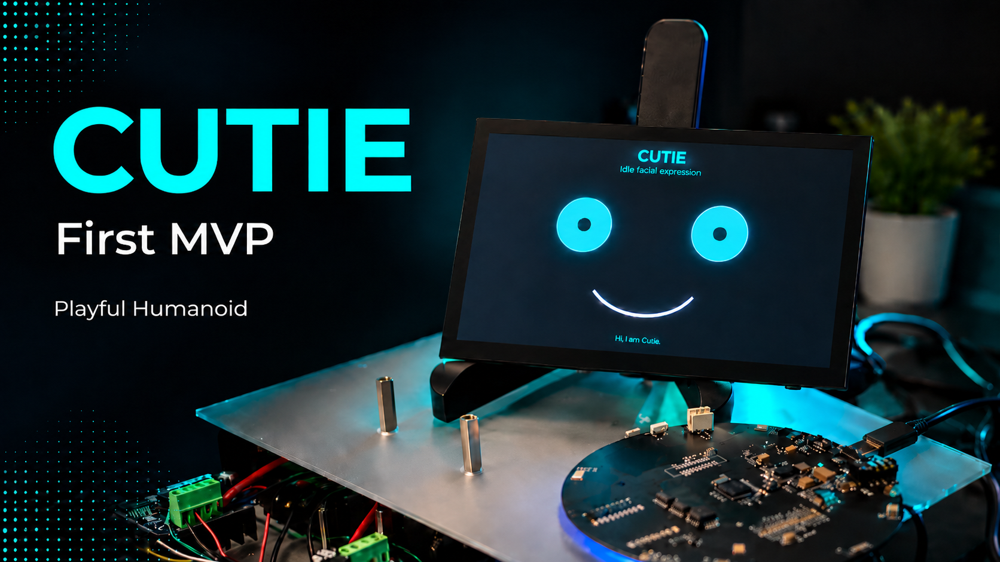
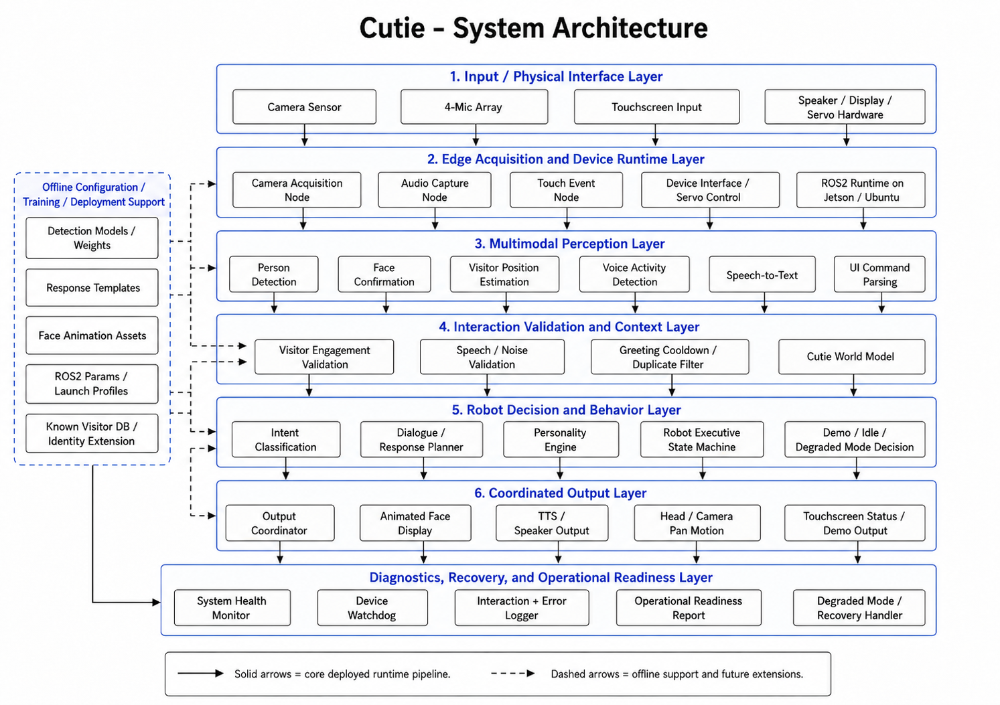

# Cutie

[](https://github.com/phoenix1revv-risefromashes/Cutie/actions/workflows/ci.yml)

Cutie is a witty, playful, interactive humanoid  head built to greet, converse with, and engage people in real environments — lobbies, demos, events, and reception spaces.

It runs fully on a **Jetson Orin Nano** with no cloud dependency: local STT via Faster Whisper, local LLM inference via Ollama (Llama 3.2), and expressive facial animations rendered in real time.

[](assets/videos/)
<sub>▶ Click to explore demos and development footage</sub>

## How it works

Cutie is a modular **ROS2 Humble** system. Each subsystem runs as an independent node:

| Package | Node | Role |
|---|---|---|
| `cutie_mic` | `cutie_microphone` | 4-mic array capture with VAD-based energy thresholding |
| `cutie_mic` | `cutie_mic_recorder` | Triggered audio recording for STT pipeline |
| `cutie_speech` | `cutie_stt` | Faster Whisper transcription (runs on-device) |
| `cutie_brain` | `cutie_llm` | Ollama / Llama 3.2 inference with reply word limiting |
| `cutie_speaker` | `cutie_speaker` | TTS audio playback |
| `cutie_face` | `cutie_face` | Facial expression rendering and animation |
| `cutie_vision` | `camera_node` | Camera feed for presence detection |

The full system launches from a single command via `cutie_bringup`.

[](assets/architecture/01_system_architecture.png)

## Stack

- **Hardware** — Jetson Orin Nano, 4-mic USB array, display
- **ROS2** — Humble (ament_python)
- **STT** — Faster Whisper (`base.en`, int8, VAD-gated)
- **LLM** — Ollama · Llama 3.2:3b · local inference
- **Vision** — OpenCV camera node

## Quick start

```bash
# Clone and build
git clone https://github.com/phoenix1revv-risefromashes/Cutie.git
cd Cutie
colcon build
source install/setup.bash

# Launch full system
ros2 launch cutie_bringup cutie_voice_demo.launch.py
```

> Requires ROS2 Humble, Ollama running locally with `llama3.2:3b` pulled, and a 4-mic USB array on `hw:CARD=Array,DEV=0`.